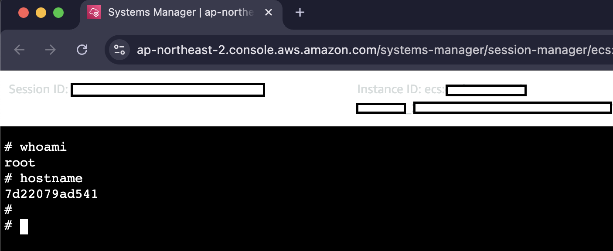
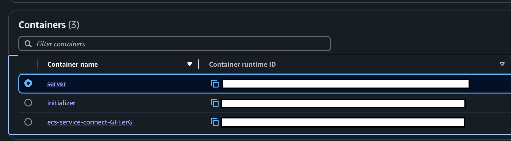

# ECS Exec

[Tampermonkey](https://www.tampermonkey.net/) user script to add hyperlink to Session Manager.

Currently, AWS does not support accessing to containers from web console like EC2. However, you can access to container via Session Manager:

Because `aws ssm start-session`'s `--target` parameter [can also take a value in format of `ecs:<cluster-name>_<task-id>_<container-runtime-id>`](https://stackoverflow.com/a/67641633), we can use it to access to containers from web.

This script attach link to Session Manager to **Container name** column.

To access the container, ECS Exec should be configured. If not configured, please refer [the official documentation](https://docs.aws.amazon.com/AmazonECS/latest/developerguide/ecs-exec.html).
