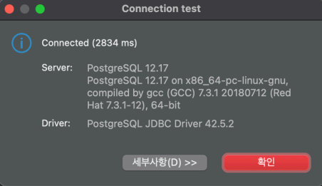

# DBeaver

Example usage on `session-manager` command to automate [DBeaver](https://dbeaver.io/) connection through Session Manager.

1. Install **aws-annoying** CLI, here we use [pipx](https://github.com/pypa/pipx):

    ```shell
    pipx install aws-annoying
    ```

2. Run DBeaver. As DBeaver by default runs script in non-login shell, environment variables may need to be forwarded.

    Below is an macOS-specific example for running DBeaver with user environment variables:

    ```shell
    export && open -a 'DBeaver'
    ```

3. Also, you can specify AWS profile to use:

    ```shell
    export && AWS_DEFAULT_PROFILE=mfa open -a 'DBeaver
    ```

4. Create new connection:

    

5. Update **Before Connect** script:

    

    ```shell
    aws-annoying session-manager port-forward --local-port ${port} --through <EC2 instance name or ID> --remote-host <Database hostname> --remote-port <Database port> --pid-file /tmp/dbeaver-${port}.pid --terminate-running-process --log-file /tmp/dbeaver-${port}.log
    ```

    Update `--thorugh`, `--remote-host` and `--remote-port` accordingly, based on your infrastructure & database engine. Also the **Pause after execute (ms)** may require change based on your network condition.

6. Update **After Disconnect** script:

    

    ```shell
    aws-annoying session-manager stop --pid-file /tmp/dbeaver-${port}.pid
    ```

7. Run **Test Connection ...** to verify setup.

    
